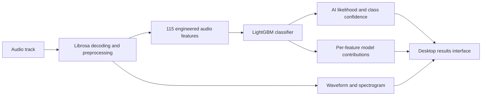

# AI Music Detector

AI Music Detector is a Windows desktop application that estimates whether a music recording contains characteristics associated with AI-generated or human-produced audio. It combines a custom audio-feature pipeline, a trained LightGBM classifier, explainable model output, interactive waveform and spectrogram visualizations, account authentication, track history, reporting tools, and a multi-screen graphical interface.

This repository is a source-code and portfolio release. It documents the engineering process behind the detector rather than presenting the model as a definitive forensic authority. AI-music detection remains an evolving research problem: generator quality, mastering style, genre, compression, and dataset composition can all affect a prediction. The application therefore reports an **AI likelihood** and a classification confidence—not “the percentage of a song that is AI.”

## Video demonstration

[](https://youtu.be/6D0yuDWPAhs)

**Watch on YouTube:** [AI Music Detector demonstration](https://youtu.be/6D0yuDWPAhs)

## Project overview

The project began as an investigation into whether measurable audio properties could distinguish machine-generated music from human recordings. It grew into a complete desktop application with four connected layers:

1. **Dataset construction:** scripts collect or generate track references, decode audio, extract numerical features, and write structured training data.
2. **Machine learning:** a gradient-boosted classifier learns relationships among those features and produces an AI-class probability.
3. **Interpretation and visualization:** model contributions are translated into a gauge, classification labels, confidence values, track-analysis data, and conservative colour-coded waveform regions.
4. **Application infrastructure:** a multi-window GUI, local authentication server, email verification, persistent history, tier-based feature controls, exports, and PyInstaller packaging turn the experiment into usable software.



## Machine-learning approach

### Why LightGBM?

The current model is a `LightGBM` `LGBMClassifier`, an implementation of gradient-boosted decision trees. This algorithm was selected because the detector operates on tabular, engineered features rather than raw audio samples. Tree ensembles are well suited to this kind of data: they can model nonlinear relationships, capture interactions between measurements, tolerate differently scaled features, and provide useful feature-importance and contribution information.

The configured model uses up to 400 boosting iterations, a learning rate of `0.05`, 31 leaves, minimum child samples of 30, row and feature subsampling of `0.8`, L2 regularization, and a fixed random seed. Early stopping on the held-out set selected 254 iterations for the saved model. These controls reduce overfitting while retaining enough capacity to model interactions among spectral, rhythmic, harmonic, and amplitude measurements.

The training pipeline also implements stratified five-fold cross-validation and out-of-fold probability generation. Stratification preserves the AI/human class balance in each fold, while out-of-fold predictions ensure that every validation prediction comes from a model that did not train on that track. A threshold table exposes the trade-off between AI recall and false accusations: raising the classification threshold reduces the number of human tracks incorrectly flagged, but allows more AI tracks to pass as human.

### Dataset and measured performance

The current training data contains 4,000 feature rows:

| Class | Tracks |
|---|---:|
| AI-generated | 1,999 |
| Human | 2,001 |
| Total | 4,000 |

After removing duplicate feature columns, the model receives 115 numerical inputs. The repository includes the saved `model_v2.pkl`, while generated feature CSVs and original audio collections are intentionally excluded from Git.

The current saved model was evaluated against the reproducible 20% stratified holdout defined in `train_model_v2.py`:

| Metric | Result |
|---|---:|
| Holdout tracks | 800 |
| Accuracy at a 0.50 threshold | 91.0% |
| ROC-AUC | 0.967 |
| Human correctly classified | 376 / 400 |
| AI correctly classified | 352 / 400 |

ROC-AUC measures ranking quality across all possible thresholds; it is not the same as accuracy. Likewise, a displayed score of 25% means the model assigned an AI-class likelihood of 0.25 under its learned distribution. It does not mean that 25% of the audio was generated by AI.

### Audio feature engineering

Feature extraction is implemented primarily in `computeinfo.py` using Librosa, NumPy, and SciPy. The pipeline converts each recording into a collection of whole-track and sectional statistics, including:

- RMS energy, dynamic range, skewness, and kurtosis;
- zero-crossing-rate statistics;
- spectral centroid, bandwidth, roll-off, flatness, flux, and contrast;
- MFCC values and MFCC deltas;
- chroma distribution and variance;
- tempo, inter-beat-interval variance, tempogram stability, and rhythm entropy;
- harmonic/percussive separation and timing offsets;
- stereo correlation and cross-feature relationships;
- phase acceleration and phase incoherence;
- pitch stability, fine pitch fluctuations, onset jitter, and breath-gap heuristics;
- measurements from the introduction, middle, ending, and other time windows.

The most important features in the saved model include ending RMS energy, spectral contrast, fine pitch fluctuation, inter-beat-interval variance, MFCC-delta behaviour, dynamic range, RMS kurtosis, zero-crossing rate, spectral flatness, stereo correlation, chroma variation, and tempo stability. No individual measurement determines the verdict. LightGBM combines many feature splits and interactions to produce the final probability.

`MachineLearning.py` complements model importance with statistical separation analysis. It uses the non-parametric Mann–Whitney U test because many audio features are skewed, calculates Cohen’s *d* effect sizes, and applies false-discovery-rate correction across simultaneous feature tests.

## Explainability and interpretation

A major design goal was to show more than a single red or green score. The application presents:

- **AI likelihood:** the model’s probability for the AI class;
- **classification:** a plain-language category ranging from “Definitely Human” to “Incredibly AI Generated”;
- **model confidence:** confidence in whichever binary class won, rather than a second copy of the AI probability;
- **track analysis:** the extracted measurements used by the model;
- **feature dictionary:** a separate, scrollable reference window explaining each measurement and what high, low, or mid-range values mean;
- **feature contributions:** LightGBM contribution values that indicate which measurements pushed the result toward AI or human.

For the Business interface, the waveform is divided into introduction, middle, and ending regions. Their colours are anchored to the full-track model result and adjusted using relevant feature contributions. Red requires strong AI evidence, yellow indicates possible AI evidence, green indicates authentic evidence, and turquoise indicates insufficient or ambiguous local evidence. Hover cards list the strongest contributing measurements for each region.

These regions are intentionally conservative. They are an explanatory overlay, not independent frame-by-frame predictions. This distinction prevents the visualization from implying that a specific number of seconds was generated by AI when the underlying classifier was trained on track-level feature vectors.

## Graphical interface

The desktop interface was created with Python’s Tkinter toolkit and CustomTkinter. Tkinter provides windows, canvases, labels, buttons, menus, scrollable areas, hover behaviour, and event handling; CustomTkinter provides modern dark-themed controls. Pillow is used for generated icons and gradient imagery, while Matplotlib embeds the spectrogram and waveform inside the application.

The interface is divided into several coordinated screens:

- **Authentication:** sign-up, email verification, login, password reset, validation states, and loading transitions.
- **Startup/upload:** animated audio-derived background visuals and track selection.
- **Analysis loading:** progress callbacks report feature-extraction stages while controls remain locked until rendering is complete.
- **Results:** waveform, spectrogram, playback controls, animated gauge, likelihood, confidence, classification, analysis dropdown, feature dictionary, and plan controls.
- **History:** a sliding panel stores previous analyses and compressed visualization arrays locally.
- **Plan selection:** Basic, Premium, Business, and Enterprise presentation cards demonstrate tier-based feature gating.
- **Exports:** analysis can be written as PDF, CSV, text, or binary output where the selected tier permits it.

Long-running decoding and analysis work is separated from the Tk event loop so the window remains responsive. UI updates are returned to the main thread through scheduled callbacks. The application also delays user interaction until plots are fully built, preventing duplicate renders and state races.

## Authentication and local services

The login system is implemented as a small FastAPI service served by Uvicorn. It uses SQLite for account records, bcrypt for password hashing, JWTs for authenticated sessions, Pydantic for request validation, and SMTP for email-verification and password-reset codes. Optional Stripe integration points are present, but the personal demonstration operates in authentication-only mode when Stripe credentials are not configured.

For the packaged application, the GUI and authentication server are separate executables. The GUI launches the server automatically, checks its health, and shuts down its owned process when appropriate. Persistent user data is placed under the current Windows account’s Local AppData directory instead of being written into the installation folder.

Private email credentials, database files, logs, history, downloaded audio, and build output are excluded by `.gitignore`. Personal SMTP settings remain outside the executable, preventing a Gmail app password from being published with the source or embedded in a distributable binary.

## Technology used

| Area | Software and libraries |
|---|---|
| Language | Python 3.11 |
| Model | LightGBM, scikit-learn |
| Data processing | Pandas, NumPy, SciPy |
| Audio analysis | Librosa, SoundFile |
| Audio playback | SoundDevice |
| Visualization | Matplotlib |
| Desktop UI | Tkinter, CustomTkinter, Pillow |
| Authentication API | FastAPI, Uvicorn, Pydantic |
| Security | bcrypt, JSON Web Tokens |
| Persistence | SQLite, JSON, compressed NumPy archives |
| Email | SMTP with Gmail app-password support |
| Audio acquisition/conversion tools | yt-dlp and FFmpeg during dataset preparation |
| Packaging | PyInstaller and PowerShell build automation |
| Version control | Git and GitHub |

## Repository structure

```text
AI_Music_Detection_Software/
├── model_v2.pkl                 # trained LightGBM model
├── .gitignore                   # excludes secrets, datasets, audio and builds
└── CodeFiles/
    ├── appGUI/
    │   ├── LoginScreen.py       # authentication and handoff UI
    │   ├── appGUI_Startup.py    # upload/startup and analysis pipeline
    │   ├── appGUI_Main.py       # results, plots, explanations and exports
    │   ├── StoreHistory.py      # local history and settings persistence
    │   ├── feature_dictionary.py
    │   └── upgrade_plan.py
    ├── Server/
    │   ├── Server.py            # FastAPI endpoints
    │   ├── Db.py                # SQLite operations
    │   ├── Auth.py              # hashing and JWT logic
    │   ├── Email_utils.py       # verification/reset email transport
    │   └── server_launcher.py   # packaged server entry point
    ├── computeinfo.py           # audio feature extraction
    ├── train_model_v2.py        # LightGBM training and evaluation
    ├── MachineLearning.py       # statistical feature-separation analysis
    ├── build_dataset.py         # dataset pipeline
    ├── process_folder.py        # batch feature processing
    ├── packaging/               # PyInstaller specifications
    └── build_personal.ps1       # personal Windows build automation
```

## Running the source

This repository is primarily intended for code review and portfolio demonstration. The YouTube video shows the complete application running in its configured development environment. A source run requires Python 3.11, the libraries listed above, the included model, and platform audio dependencies.

From `CodeFiles`, the application entry point is:

```powershell
python .\appGUI\LoginScreen.py
```

Server-specific dependencies are listed in `CodeFiles/Server/requirements.txt`. Real email delivery additionally requires a private, ignored `Server/email_secrets.py` containing `SMTP_USER` and `SMTP_PASSWORD`, or equivalent environment variables. Never commit real credentials.

Generated datasets, source audio collections, user databases, local history, logs, FFmpeg executables, and packaged builds are not included. Rebuilding the model requires recreating the dataset and updating the local paths used by the data-preparation scripts.

## Why this project is significant

This project demonstrates more than fitting a classifier. It covers the complete lifecycle of an applied machine-learning product: collecting and transforming data, defining interpretable measurements, comparing feature distributions, validating a model, reasoning about classification thresholds, exposing uncertainty, designing an interactive interface, managing background work, persisting user state, implementing authentication, protecting secrets, and packaging a multi-process desktop application.

It also addresses an important communication problem in AI detection. A confident-looking percentage can easily be misunderstood as proof. The application separates likelihood, verdict, and confidence; provides feature-level explanations; preserves a neutral state when local evidence is insufficient; and explicitly avoids claiming that coloured waveform regions are independently classified pieces of audio.

For a solo project, the breadth is substantial: audio signal processing, tabular machine learning, statistical analysis, UI/UX design, asynchronous desktop programming, API development, security fundamentals, persistence, visualization, and deployment all meet in one system. The result is both a functional prototype and a record of the engineering decisions, debugging, calibration, and iteration required to turn an experimental model into an understandable application.

## Limitations and future work

- Results depend on the genres, generators, production styles, codecs, and mastering practices represented in the training data.
- The current score is a model likelihood, not legal or forensic proof of authorship.
- Unusual human mixes and highly polished synthetic tracks may produce false positives or false negatives.
- The model should be evaluated on larger, independently sourced, generator-disjoint test sets.
- Probability calibration should be measured explicitly before interpreting scores as real-world probabilities.
- Future versions could combine acoustic detection with provenance metadata, watermark checks, source attribution, and ensemble models.
- Batch processing, clearer dataset manifests, automated tests, and a reproducible dependency lock file would strengthen a production release.

## Author

Created by **Dominic Cristello** as an independent machine-learning, audio-analysis, and desktop-software project.

Project repository: [github.com/DominicCristello/AI-Music-Detector](https://github.com/DominicCristello/AI-Music-Detector)
